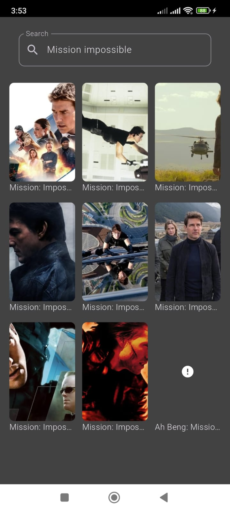

# Movies App
Movie app made in Flutter with clean architecture using BLoC, Hive and the movie db API.
App Video -> https://drive.google.com/file/d/13H3HcUH_aHHs9v3MR3zWTFzMscPpTw5y/view?usp=drivesdk
------------------------------------------------------------------------------------------------
# Features
* Search feature
* Watchlist feature
* Up Coming movies
* Popular movies
* Top rated movies
* Movie details
* Movie cast
* Movie reviews
* Similar movies
* Watch Trailers
  
# Screenshots
         

         

# Packages 
* [cached_network_image](https://pub.dev/packages/cached_network_image)
* [carousel_slider](https://pub.dev/packages/carousel_slider)
* [dartz](https://pub.dev/packages/dartz)
* [dio](https://pub.dev/packages/dio)
* [equatable](https://pub.dev/packages/equatable)
* [flutter_bloc](https://pub.dev/packages/flutter_bloc)
* [get_it](https://pub.dev/packages/get_it)
* [hive](https://pub.dev/packages/hive)
* [hive_flutter](https://pub.dev/packages/hive_flutter)
* [conditional_builder_null_safety](https://pub.dev/packages/conditional_builder_null_safety)
* [path_provider](https://pub.dev/packages/path_provider)
* [youtube_player_flutter](https://pub.dev/packages/youtube_player_flutter)
